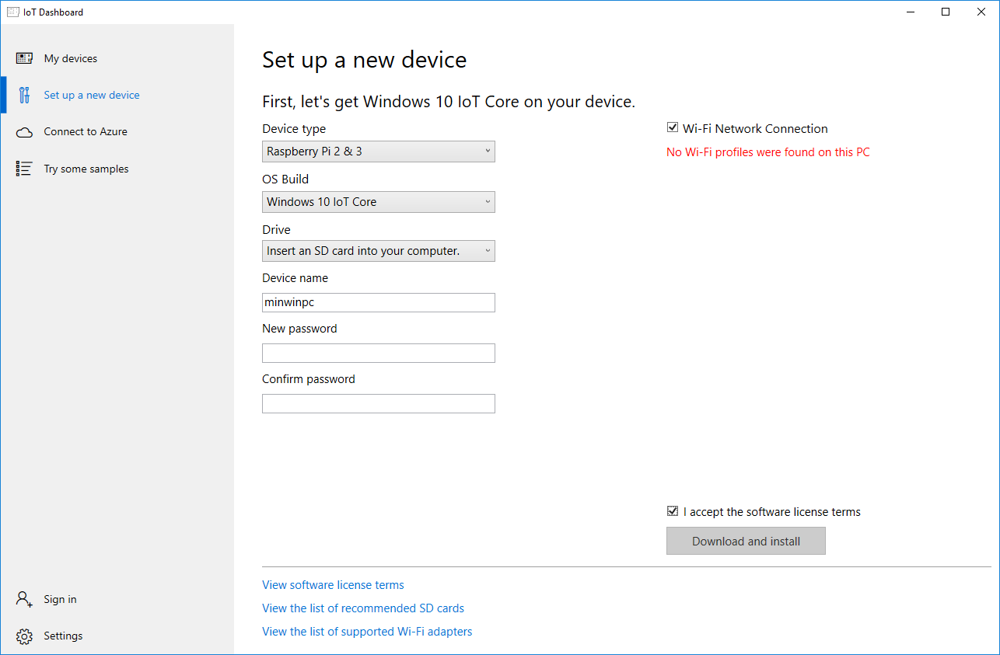
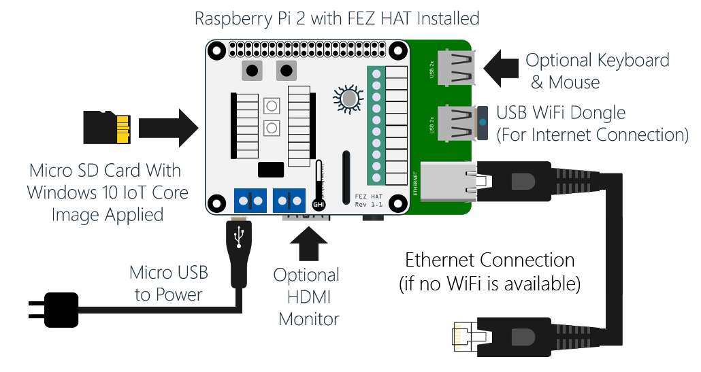
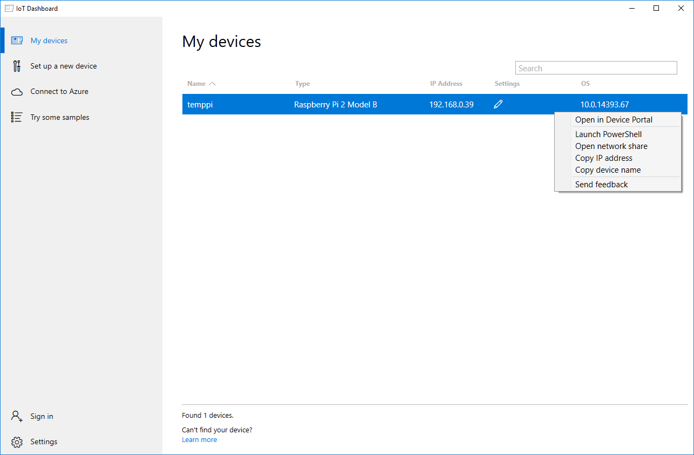
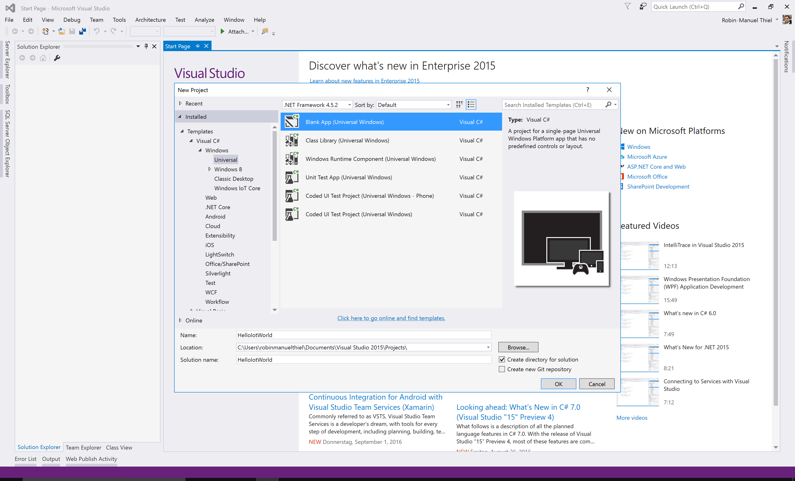
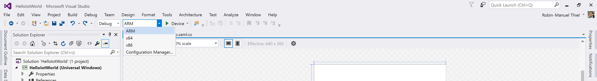
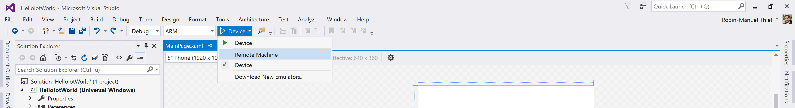

# Setting up
Coming soon...

## 1. Setting up your development environment
To work with Windows 10 IoT core from a developer's perspective, you need a bunch of tools and helpers installed on your machine. Follow the instructions below to get your device ready for development. As we are creating Universal Windows apps in this lab, make sure to select the *Universal Windows App Development Tools* when installing Visual Studio 2015

> **Hint:** As the installation of Visual Studio 2015 can take some time, you can already proceed with the following steps while installing

1. Install any version of [Visual Studio 2015](https://www.visualstudio.com/products/visual-studio-community-vs) with Update 3 and Universal Windows App Development Tools.
2. Install the [Windows IoT Core Project Templates](https://visualstudiogallery.msdn.microsoft.com/55b357e1-a533-43ad-82a5-a88ac4b01dec) to extend Visual Studio with IoT project templates.
3. Make sure you’ve [enabled Windows 10 developer mode](https://msdn.microsoft.com/windows/uwp/get-started/enable-your-device-for-development)
4. Install the [Windows IoT Core Dashboard](https://developer.microsoft.com/en-us/windows/iot/downloads) to manage your devices.

## 2. Install Windows IoT Core on your MicroSD card
Due the Raspberry Pi has now own storage beside the MicroSD card, the operating system can only be installed there. This has the advantage that you are able to hot swap operating systems and different environments on your Pi by simply replacing the card.

To provision a MicroSD card with Windows IoT core, you can simply insert the card into your card reader and open the Windows 10 IoT Core Dashboard app. Navigate to ***Set up a new device*** and fill out the form.

If your Raspberry Pi has a Wi-Fi connection (Raspberry Pi 3 or connected with [one of these](https://developer.microsoft.com/en-us/windows/iot/Docs/HardwareCompatList.htm#WiFi-Dongles)), you can directly set it up here, if your PC also has a Wi-Fi module. If you do so, the device automatically connects to the selected network as soon as it gets booted for the first time.

> **Hint:** You can only select those Wi-Fi networks, your host has been connected to at some time. To connect your Raspberry Pi to a network that is not listed, connect your host PC to it first.



If you are satisfied with the settings, hit ***Download and install*** and let the tool do the rest.

## 3. Setting up the Raspberry Pi



Once the MicroSD card is ready and Windows 10 IoT Core has been successfully installed, you are ready to set up the device.

1. Insert the MicroSD card
2. Connect to network via Ethernet or Wi-Fi (if available)
3. Mount the FET Hat to the GPIO ports as seen in the image above
4. Connect to external display with HDMI (optional)
5. Last, connect MicroUSB cable for power

Once the Raspberry gets a power connection, it starts the booting process automatically. Especially at the first time, this can take a couple of minutes. If your Pi is connected to a display, you can follow the booting process. Otherwise just wait some minutes. If your Raspberry is connected to the same network as your computer, it should show up at the *My devices* section of the IoT Dashboard as soon it is available.

## 4. Connect with your Raspberry Pi
Once your Raspberry is booted completely and connected to the network, it will show up at the IoT Dashboard's ***My devices*** section as you can see below. Here you can see the device's name, IP address and OS version. A rightclick offers additional actions.



### Connect with the web portal
The simplest way to do administration work on your device is the web portal that comes with Windows 10 IoT Core build. Open it by entering `https://<ip-address-or-name>:8080` in your browser or simply select the ***Open in Device Portal*** entry in the context menu.

Log in using the credentials you chose when setting up the MicroSD card. Make sure that the user name follows the `devicename\username` schema. If you didn't choose a user name or password you can try the [default credentials](../../../wiki/default-credentials).

Using the Device Portal you can administrate the most important things:

- Change username and password
- Set date, time and time zone
- Connect to Wi-Fi networks
- Start and stop applications
- Monitor processes, CPU and RAM performance

> **Hint:** It is *highly recommended* to connect with a wireless network and adjust the date and time to the correct time zone to avoid communication problems.

### Connect with PowerShell (optional)
Coming soon...

## 5. Deploy your first app
Now you are ready to create your first application for Windows 10 IoT Core and run it on the device. Windows 10 IoT Core is part of the Universal Windows Platform (UWP) which means that we can create Universal Windows Apps for it that can also run on Windows 10 Desktop PCs, Phones and even the Xbox One or HoloLens.

### Create a new project
To create a Universal Windows App, open Visual Studio 2015 and select ***File*** -> ***New*** -> ***Project...*** to open the new project dialog. Navigate through the installed project templates and find the ***Blank App (Universal Windows)*** at the ***Visual C#*** -> ***Windows*** -> ***Universal*** folder.

Give your project a name and click on ***OK*** to let Visual Studio create an empty Universal Windows App.



### Hello World
Once the project is created, navigate to the `MainPage.xaml` file in the Solution Explorer and add a simple text field at in the empty `<Grid>` block to create a welcome message in center of your app's UI:

```XAML
<Grid Background="{ThemeResource ApplicationPageBackgroundThemeBrush}">
    <TextBlock Text="Hello World" HorizontalAlignment="Center" VerticalAlignment="Center" />
</Grid>
```

### Run app on device
Now you are ready to run the app on your device. For this, first make sure that Visual Studio compiles the project to the correct processor architecture. If you use a Raspberry Pi, the correct architecture to compile against is `ARM`.



Afterwards choose your device as the deployment target for your app. For this, change the deployment target to ***Remote Machine***.



Once you selected ***Remote Machine***, the Remote Connections windows should appear. Enter your device's IP address to the address field and keep the authentication mode on *Universal (Unencrypted Protocol)*. This tells Visual Studio to send the application to your device and start / debug it there.

> **Hint:**  If the Remote Connections windows does not appear, a remote target has been defined previously. Hit over to the wiki's [Change Remote Deploy Target](../../../wiki/Change-Remote-Deploy-Target) section to learn how to change it.

As  soon as Visual Studio is connected to the target device you are ready to run it. Hit the green ***Run*** button at the top toolbar to run your application. If your device is connected to an external display, you should see the "Hello World" message at the center of the screen now.

> **Hint:** Usually the Blinky application is the Hello World equivalent in the IoT world. In this example you learn the basic interaction with the GPIO ports and let an LED blink. If you are interested in learning these basics, take a look at the [*Blinky module*](../06%20Blinky) of this lab.
