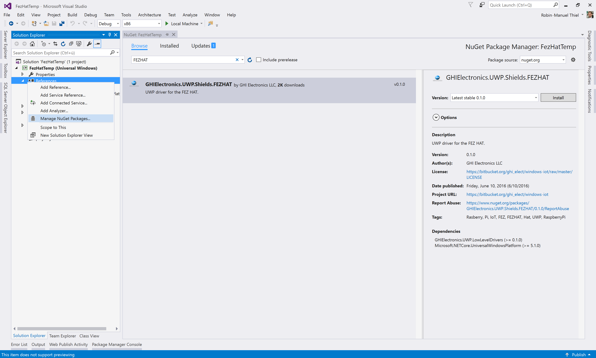
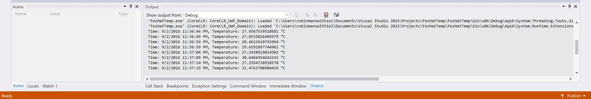

# Receiving values
You are ready to create your first real world application. In this module we will use the FET Hat to read temperature values from your Raspberry Pi to be ready to process and send them to the cloud in the next module.

> **Hint:** If you got stuck during this module or lost the overview on where to place which code, you can always take the look at the [finished and working project](./Code) that is attached to this module.

## 1. Create the project
Again, we need a new UWP application first. As learned in [05 Setting up](05%20Setting%20up#5-deploy-your-first-app), open Visual Studio 2015 and select ***File*** -> ***New*** -> ***Project...*** to open the new project dialog. Navigate through the installed project templates and find the ***Blank App (Universal Windows)*** at the ***Visual C#*** -> ***Windows*** -> ***Universal*** folder. After naming your project, click on ***OK*** to get started with the empty project.


## 2. Add necessary 3rd party libraries
As the [GHI FEZ Hat](https://www.ghielectronics.com/catalog/product/500) is from a third-party vendor, its functionality and bits are not included into Windows 10 IoT Core be default, of course. Fortunately, GHI provides an [official library](https://www.nuget.org/packages/GHIElectronics.UWP.Shields.FEZHAT/) for working with the FEZ Hat on Windows via NuGet. NuGet is a package management system that comes with Visual Studio and is very popular in the .NET community.

To add this library to your project via NuGet, right click on the ***References*** folder of your project in Visual Studio and select ***Manage NuGet Packages...*** to open the NuGet package manager for your project.

Head over to the ***Browse*** tab and search for "`FEZHat`". The `GHIElectronics.UWP.Shields.FEZHAT` package should appear in the results list. Select the package and hit the ***Install*** button on the right to add it to the project.



> **Hint:** If you know the exact name of a package, like we do from the [NuGet webiste](https://www.nuget.org/packages/GHIElectronics.UWP.Shields.FEZHAT/), you could also open the Package Manager Console in Visual Studio and simply type this to add the package via console:
```
PM> Install-Package GHIElectronics.UWP.Shields.FEZHAT
```

## 3. Initialize the FEZ Hat
Now that all the needed bits are available, we can start coding. Navigate to the `MainPage.xaml.cs` file as this is the common entry point for most UWP applications and reference the recently added library below the other `using` statments at the top.

```csharp
using GHIElectronics.UWP.Shields;
```

Now we can use types like `FEZHAT` that we need to communicate with the FEZ Hat attachment on the Raspberry Pi. So let's add declare a variable for it above the `MainPage()` constructor.

```csharp
private FEZHAT fezHat;
```

As soon as the `MainPage` got loaded completely, we can talk to the `FEZHAT`. For this, we need to subscribe to the `MainPage`'s `Loaded` event and initialize the hat with `fezHat = await FEZHAT.CreateAsync();` so that the class should now look like this:

```csharp
public sealed partial class MainPage : Page
{
    private FEZHAT fezHat;

    public MainPage()
    {
        this.InitializeComponent();
        this.Loaded += MainPage_Loaded;
    }

    private async void MainPage_Loaded(object sender, RoutedEventArgs e)
    {
        fezHat = await FEZHAT.CreateAsync();
    }
}
```

## 4. Read values from the FEZ Hat
Once the Hat is initialized, we can start working with it. First, we need to define when we want to take a measurement, so let's create a timer that triggers the measurement function every 5 seconds. Create a `DispatcherTimer` variable for that, to store the timer.
```csharp
private DispatcherTimer timer;
````

Now add the timer definition just below the FEZ Hat initialization inside the `MainPage_Loaded` method.
```csharp
timer = new DispatcherTimer();
timer.Interval = TimeSpan.FromSeconds(5);
timer.Tick += Timer_Tick;
timer.Start();
````
This defines a timer, that fires the `Timer_Tick` method every five seconds from now. Make sure that this function exist by adding it below the `MainPage_Loaded` mehtod.
```csharp
private void Timer_Tick(object sender, object e)
{
    // Take measurement
}
```
Inside this method we can take the temperature measurement by simply calling the `FEZHAT`'s `GetTemperature()` method. It returns the Hat's current temperature in Celsius. Let's store this in a local variable within the `Timer_Tick` method for later. To check if everything works as expected, we should print out the temperature together with a current timestamp in the ***Output*** window. Consider that you need to add another using statement to work with the `Debug` class.
```csharp
using System.Diagnostics;
```
```csharp
private void Timer_Tick(object sender, object e)
{
    // Take measurement
    var temp = fezHat.GetTemperature();
    Debug.WriteLine($"Time: {DateTime.Now}, Temperature: {temp} \u00B0C");
}
```
> **Hint:** We use `\u00B0` here to escape the degree symbol (°).

Now you can deploy the code on your Raspberry Pi and run it as [learned in Module 05](../05%20Setting%20up#run-the--app-on-your-device). As soon as the application is running, you should see a new time and temperature pair inside the ***Output*** window every five seconds.



> **Hint:** Remember that you can check out the attached [finished project code](./Code) at any time you got stuck or need help on how your code should look like.

## 5. Update the UI (optional)
If your Raspberry Pi is connected to an external display via HDMI, you could also update the UI to show the current temperature value on the screen. For this, open the `MainPage.xaml` file and add the following line to create a centered text field:
```xaml
<Grid Background="{ThemeResource ApplicationPageBackgroundThemeBrush}">
    <TextBlock x:Name="TemperatureText" HorizontalAlignment="Center" VerticalAlignment="Center" />
</Grid>
```
Using its name `TemperatureText` we can update the text everytime we take a measurement.
```csharp
private void Timer_Tick(object sender, object e)
{
    // Take measurement
    var temp = fezHat.GetTemperature();
    Debug.WriteLine($"Time: {DateTime.Now}, Temperature: {temp} \u00B0C");
    
    // Update UI
    TemperatureText.Text = $"Temperature: {temp} \u00B0C";
}
```

When you run your code again and got your device attached to an external screen you should also see the temperature updates there.
